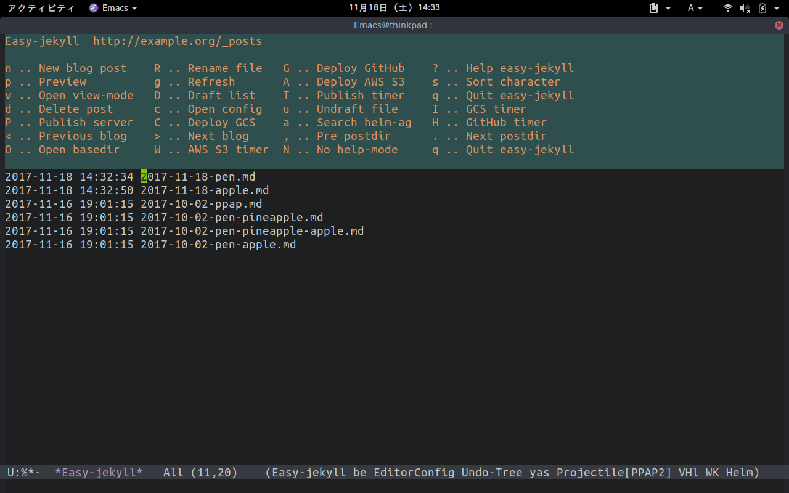
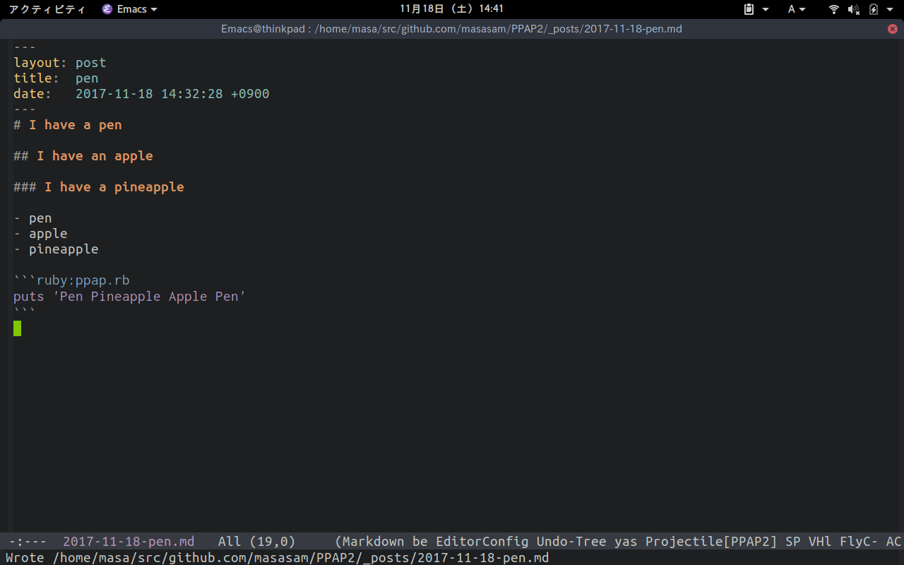
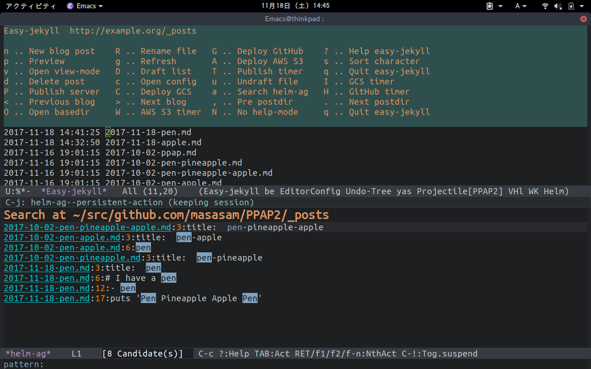
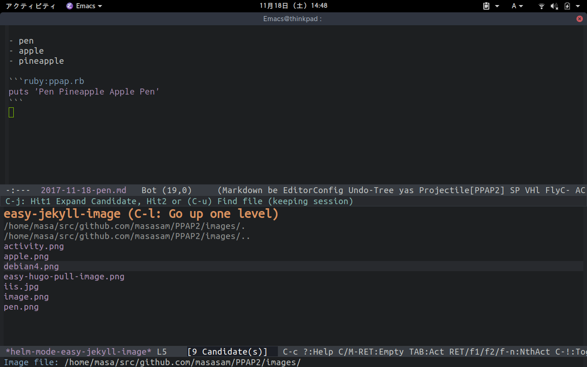
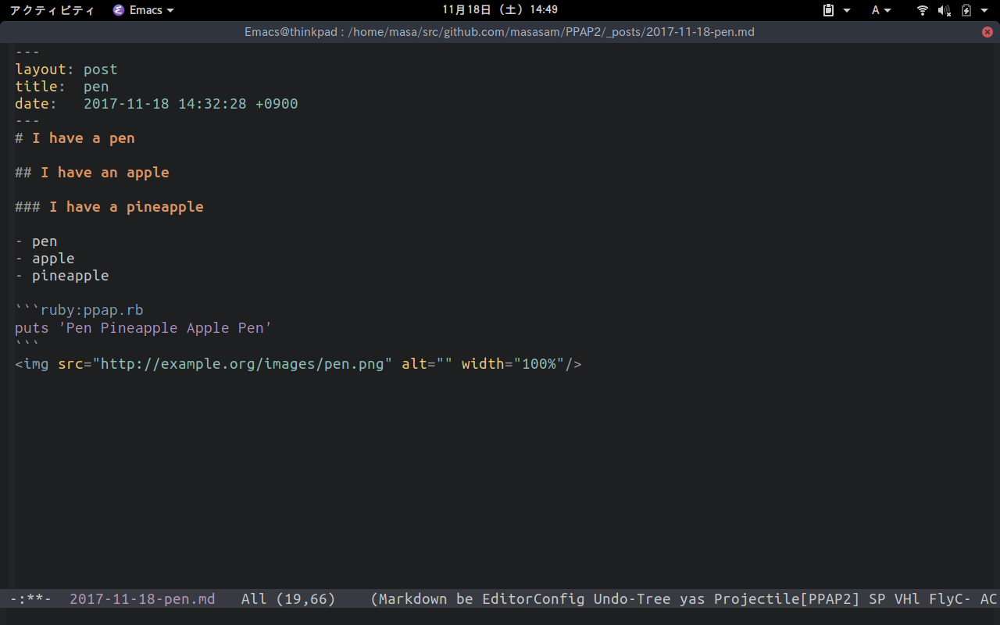
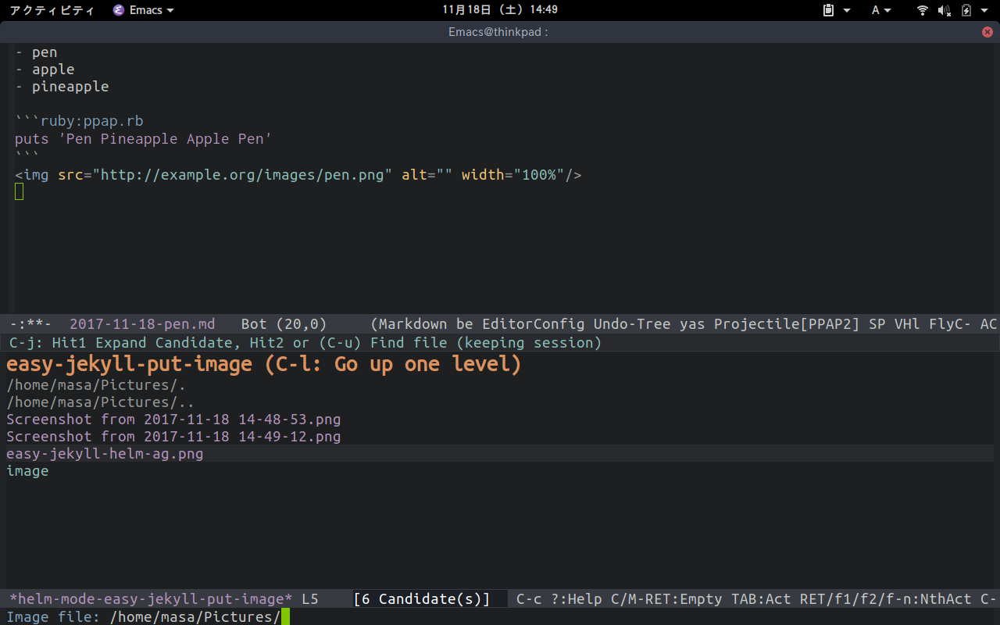
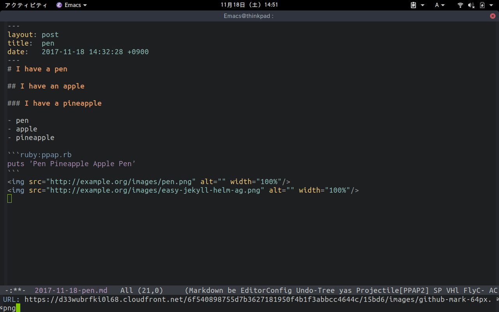
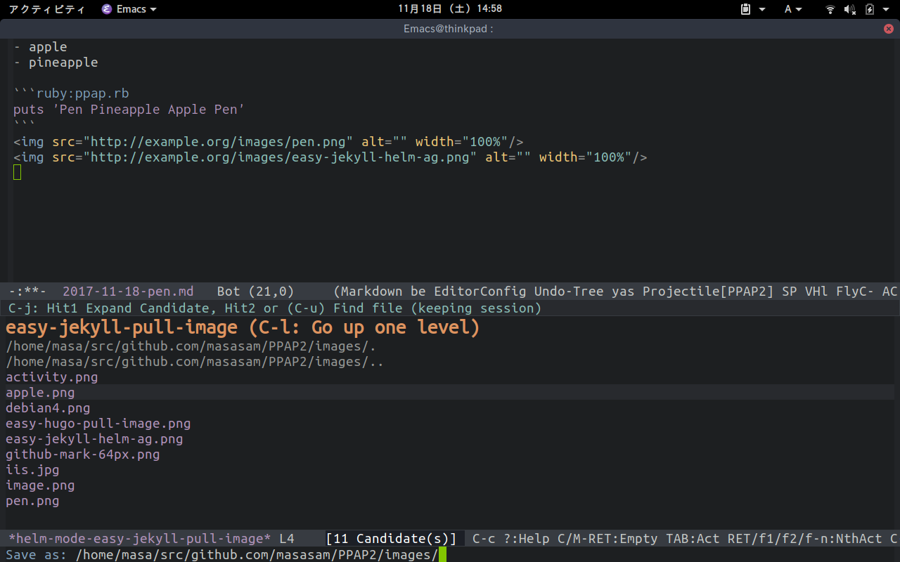
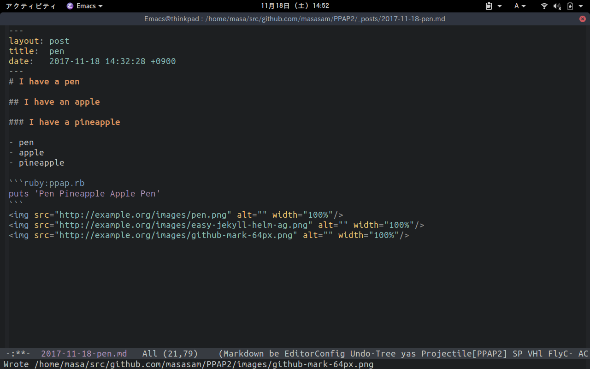

# easy-jekyll

Emacs major mode for managing jekyll blogs

## Screencast

	M-x easy-jekyll

You can manage blogs on easy-jekyll-mode.

If you manage multiple blogs, you can switch blogs with the < or > key.

    M-x easy-jekyll-newpost

You can post a new article.

Enter a article file name in the minibuffer.

A markdown file is automatically generated.

You can write a blog with markdown.

If you enter '.textile' file name in the minibuffer, textile file is automatically generated and you can write a blog with textile.

    M-x easy-jekyll-preview

(The picture of the header is http://www.pixiv.net/member_illust.php?mode=medium&illust_id=60674880)

The browser opens automatically and you can preview the blog on your PC.

Even if you run the easy-jekyll-preview command many times, only one jekyll process will run so do not mind it.

Since the process of jekyll running in the PC disappears in 300 seconds, you do not have to worry about killing jekyll process.

    M-x easy-jekyll-publish

You can publish your blog to the server and the browser opens automatically.

	M-x easy-jekyll-helm-ag

You can search blog article with [helm-ag](https://github.com/syohex/emacs-helm-ag).

	M-x easy-jekyll-github-deploy

Execute deploy.sh which exists in directory `easy-jekyll-basedir`.

It is useful for hosting on [GitHub Pages](https://help.github.com/articles/using-jekyll-as-a-static-site-generator-with-github-pages/) etc.

Example of deploy.sh

	#!/bin/bash
	git checkout gh-pages
	git add -A
	git commit -m "Update blog"
	git push origin gh-pages

Don't forget granting execute permission to deploy.sh.

	M-x easy-jekyll-amazon-s3-deploy

Deploy jekyll source at Amazon S3.

	M-x easy-jekyll-google-cloud-storage-deploy

Deploy jekyll source at Google Cloud Storage.

	M-x easy-jekyll-image

Generate link of image from image file directory under 'easy-jekyll-image-directory' directory.

'easy-jekyll-image-directory' default is 'images'.

When you select the image file you want to use, a link will be inserted.

	M-x easy-jekyll-put-image

Move image to 'easy-jekyll-image-directory' and generate image link.

You can change the initial launch position with 'easy-jekyll-default-picture-directory'.

	M-x easy-jekyll-pull-image

Pull image from internet to image directory and generate image link.

Copy the URL of the image you want to download with your browser.

Execute M-x easy-jekyll-pull-image.

Decide file name.

If you press enter without deciding the file name, the file name can be used as it is.

The file is saved in 'easy-jekyll-image-directory' and generate image link.

## Commands for easy-jekyll-mode

|key    |function      |
|-------|--------------|
|o		|easy-jekyll-open|
|e      |easy-jekyll-open|
|f		|easy-jekyll-open|
|RET	|easy-jekyll-open|
|<		|easy-jekyll-previous-blog|
|>		|easy-jekyll-next-blog|
|?		|describe-mode|
|A		|easy-jekyll-amazon-s3-deploy|
|C		|easy-jekyll-google-cloud-storage-deploy|
|D		|easy-jekyll-list-draft|
|G		|easy-jekyll-github-deploy|
|H		|easy-jekyll-github-deploy-timer|
|I		|easy-jekyll-google-cloud-storage-deploy-timer|
|i		|easy-jekyll-cancel-google-cloud-storage-deploy-timer|
|N		|easy-jekyll-no-help|
|O		|easy-jekyll-open-basedir|
|P		|easy-jekyll-publish|
|R		|easy-jekyll-rename|
|s		|easy-jekyll-sort-char|
|T		|easy-jekyll-publish-timer|
|W		|easy-jekyll-amazon-s3-deploy-timer|
|a		|easy-jekyll-helm-ag|
|b		|easy-jekyll-cancel-github-deploy-timer|
|c		|easy-jekyll-open-config|
|d		|easy-jekyll-delete|
|g		|easy-jekyll-refresh|
|h		|easy-jekyll-backward-char|
|j		|easy-jekyll-next-line|
|k		|easy-jekyll-previous-line|
|l		|easy-jekyll-forward-char|
|m		|easy-jekyll-cancel-amazon-s3-deploy-timer|
|n		|easy-jekyll-newpost|
|p		|easy-jekyll-preview|
|q		|easy-jekyll-quit|
|r		|easy-jekyll-refresh|
|S		|easy-jekyll-sort-time|
|t		|easy-jekyll-cancel-publish-timer|
|u		|easy-jekyll-undraft|
|v		|easy-jekyll-view|
|w		|easy-jekyll-newpost|
|SPC	|easy-jekyll-next-line|
|S-SPC	|easy-jekyll-previous-line|
|←	    |easy-jekyll-backward-char|
|→     |easy-jekyll-forward-char|
|C-b	|easy-jekyll-backward-char|
|C-f	|easy-jekyll-forward-char|
|C-n	|easy-jekyll-next-line|
|C-p	|easy-jekyll-previous-line|
|M-b	|easy-jekyll-backward-word|
|M-<	|easy-jekyll-beginning-of-buffer|

## Requirements

- Emacs 24.4 or higher
- jekyll 3.5.1 or higher

## Installation

You can install `easy-jekyll.el` from [MELPA](http://melpa.org) with package.el
(`M-x package-install easy-jekyll`).

## Sample Configuration

	(setq easy-jekyll-basedir "~/my-awesome-site/")
	(setq easy-jekyll-url "https://yourblogdomain")
	(setq easy-jekyll-sshdomain "blogdomain")
	(setq easy-jekyll-root "/home/blog/")
	(setq easy-jekyll-previewtime "300")
	(define-key global-map (kbd "C-c C-e") 'easy-jekyll)

easy-jekyll-basedir "Directory where jekyll html source code is placed on your PC."

easy-jekyll-url "Url of the blog."

easy-jekyll-sshdomain "Domain written in ~/.ssh/config."

easy-jekyll-root "Root directory of jekyll at your server."

easy-jekyll-previewtime "Preview display time."

If you want deploy jekyll at Amazon S3, please install AWS CLI and set easy-jekyll-amazon-s3-bucket-name.

	(setq easy-jekyll-amazon-s3-bucket-name "your-amazon-s3-bucket-name")

If you want deploy jekyll at Google Cloud Storage, please install Google Cloud SDK and set easy-jekyll-google-cloud-storage-bucket-name.

	(setq easy-jekyll-google-cloud-storage-bucket-name "your-google-cloud-storage-bucket-name")

If you want the default extension to be '.textile'.

If not set the default extension will be '.md'.

	(setq easy-jekyll-default-ext ".textile")

If you want to change to No help-mode from startup

	(setq easy-jekyll-no-help t)

If you want to set sort time at s key.
If not set the default s key will be charactor-sort.

	(setq easy-jekyll-sort-default-char nil)

If you want customise color, write the following in the init.el or .emacs.

	(defface easy-jekyll-help-face
	'((((class color) (background light)) (:bold t :foreground "your-hex-color" :background "your-hex-color"))
    (((class color) (background dark)) (:bold t :foreground "your-hex-color" :background "your-hex-color")))
	""
	:group 'easy-jekyll-faces)

In order to generate link of image from image file directory under 'easy-jekyll-image-directory' directory,

If you want to change image file directory under 'images' directory.

If not set the default image file directory will be 'images'.

	(setq easy-jekyll-image-directory "img")

Setting the picture directory of your PC, it is easy to execute M-x easy-jekyll-put-image

	(setq easy-jekyll-default-picture-directory "~/Pictures")

If you want to manage multiple blogs.

Example of setting when adding two blogs and managing a total of three blogs.

	;; Main blog
	(setq easy-jekyll-basedir "~/my-awesome-site/")
	(setq easy-jekyll-url "https://yourblogdomain")
	(setq easy-jekyll-sshdomain "blogdomain")
	(setq easy-jekyll-root "/home/blog/")
	(setq easy-jekyll-previewtime "300")
	(define-key global-map (kbd "C-c C-e") 'easy-jekyll)
	;; Total number of blogs
	(setq easy-jekyll-blog-number 3)
	;; Blog1
	(setq easy-jekyll-basedir-1 "~/src/github.com/masasam/jekyll1/")
	(setq easy-jekyll-url-1 "http://example1.com")
	(setq easy-jekyll-root-1 "/home/blog/")
	(setq easy-jekyll-sshdomain-1 "blog1domain")
	;; Blog2
	(setq easy-jekyll-basedir-2 "~/src/github.com/masasam/jekyll2/")
	(setq easy-jekyll-url-2 "http://example2.com")
	(setq easy-jekyll-amazon-s3-bucket-name-2 "blogbucket")

A total of until 10 blogs can be managed.

Please set necessary variables and use.

	easy-jekyll-basedir-1
	easy-jekyll-url-1
	easy-jekyll-root-1
	easy-jekyll-sshdomain-1
	easy-jekyll-amazon-s3-bucket-name-1
	easy-jekyll-google-cloud-storage-bucket-name-1
	easy-jekyll-image-directory-1

	..............

	easy-jekyll-basedir-9
	easy-jekyll-url-9
	easy-jekyll-root-9
	easy-jekyll-sshdomain-9
	easy-jekyll-amazon-s3-bucket-name-9
	easy-jekyll-google-cloud-storage-bucket-name-9
	easy-jekyll-image-directory-9

If you want change markdown filename extension, please select markdown.
Because only markdown is supported by jekyll. If not set markdown filename extension will be 'md'.

	(setq easy-jekyll-markdown-extension "markdown")

## Preparation for using this package

Install jekyll and bundler

	gem install jekyll bundler
	jekyll new my-awesome-site

See https://jekyllrb.com/

### Configuration file example

_config.yml

	title: PPAP-blog
	email: picotaro@example.com
	description: > # this means to ignore newlines until "baseurl:"
	baseurl: "" # the subpath of your site, e.g. /blog
	url: "" # the base hostname & protocol for your site, e.g. http://example.com
	twitter_username: jekyllrb
	github_username:  jekyll
	markdown: kramdown
	theme: minima
	plugins:
	- jekyll-feed

### Prepare the server

Let's build with a free trial of "google compute engine" or "amazon ec2".

If you want deploy jekyll at GitHub Pages or Amazon S3 or Google Cloud Storage, This paragraph is not necessary.

I created my blog in google compute engine.

Check if rsync is installed on the server.

Write at ~/.ssh/config on your PC

	 Host blogdomain
                        HostName "Your server's IP"
                        User "Your server's ssh login username"

Because blog is generated under /home/blog/ on the server, set it to reference it with nginx.
SSL uses certbot (Let's encrypt).

sample nginx.conf

	server {
		listen 80;
		server_name yourdomain;
		return  301 https://yourdomain$request_uri;
		location / {
			root /home/blog;
		index	index.html index.htm;
		}
	}
	server {
		listen 443;
		server_name yourdomain;
		ssl on;
		ssl_certificate      /etc/letsencrypt/live/yourdomain/fullchain.pem;
		ssl_certificate_key  /etc/letsencrypt/live/yourdomain/privkey.pem;

	location / {
		root    /home/blog;
	index   index.html index.htm;
		}
	}

Confirm that PATH passes from emacs to jekyll.

I recommend you [exec-path-from-shell]( https://github.com/purcell/exec-path-from-shell).

PPAP blog source code sample for jekyll

https://github.com/masasam/PPAP2

[melpa-link]: http://melpa.org/#/easy-jekyll
[melpa-badge]: http://melpa.org/packages/easy-jekyll-badge.svg
[melpa-stable-link]: http://stable.melpa.org/#/easy-jekyll
[melpa-stable-badge]: http://stable.melpa.org/packages/easy-jekyll-badge.svg
